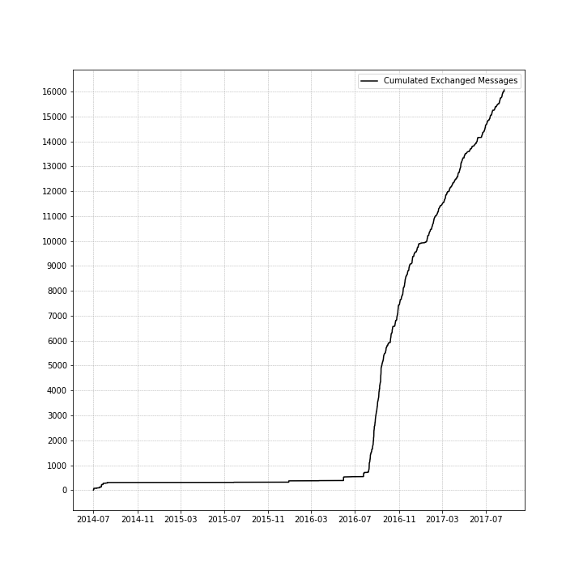
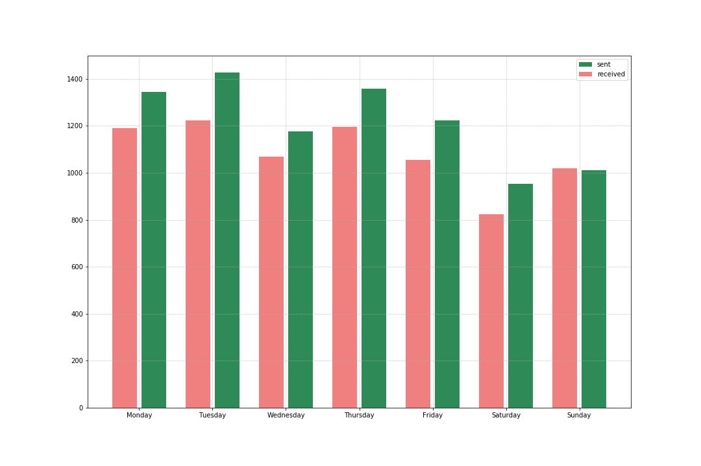

# ChatLocator

**Content**

- Analysis of chat history
- Combining with Google location history

*Due to the private nature of the data, I removed all data files and names. I also didn't upload the resulting map, because the location history Google provides is very detailed.*

## This is a little analysis of the WhatsApp history with my girlfriend.

### Analysis of Chat History
In the notebook [ChatStat](ChatStat.ipynb), I take a quick look at the temporal aspect of our chats. 

Here's the cumulative sum of messages sent *by date*, maybe you can guess when we started dating:

We met a couple of years prior the beginning of the plot and chatted occasionally, but the messaging kicked in very noticably when we started seeing each other regularly.

---------

But at what *time of the day* did we chat? Who sent whom when how many messages? Here's the plot:

This plot shows the number of all messages I sent and I received per hour in the 24-hour-system. I binned all messages into 24 bins by their timestamp.

----------

Let's also check out how many messages we sent (in total) per *day of the week*, separated into messages I *received* and messages I *sent*:

There's a noticable drop in messages on Saturdays -- we had a long distance relationshipt for quite a while and often only saw each other on the weekends. Friday and Sunday being travel days meant that only the Saturdays were spent together completely.

---------

### Combination with Google Location
In the second notebook, [MapChat](MapChat.ipynb), I combine these data with my Google location history and plot a zoomable and scrollable heatmap showing *where* I chatted with my girlfriend. Here's a screen shot of a part of the map:

In the actual map you could zoom in all the way Google Maps allows to see precisely where I was when I sent or received a message. Let this screen shot suffice to show where I lived at the time (Munich) and my travels through Germany during that time period.

