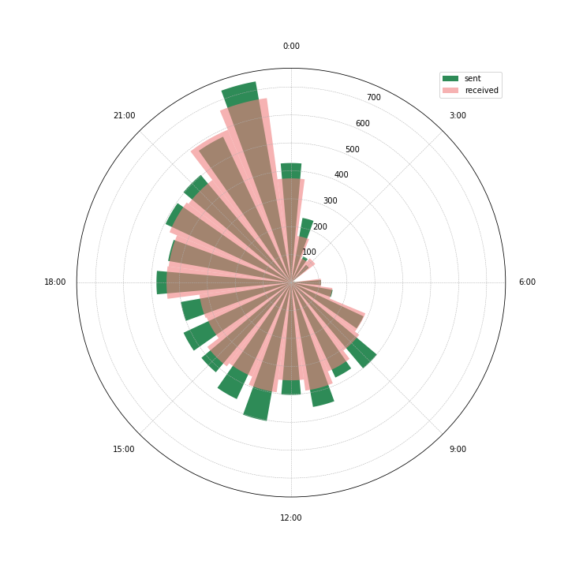

# ChatLocator

**Content**

- Analysis of chat history
- Combining with Google location history

*Due to the private nature of the data, I removed all data files and names. I also didn't upload the resulting map, because the location history Google provides is very detailed.*

## This is a little analysis of the WhatsApp history with my girlfriend.

### Analysis of Chat History
In the notebook [ChatStat](ChatStat.ipynb), I take a quick look at the temporal aspect of our chats. 

Here's the cumulative sum of messages sent *by date*, maybe you can guess when we started dating:

---------

But at what *time of the day* did we chat? Who sent whom when how many messages? Here's the plot:

Let's also check out how many messages we sent (in total) per *day of the week*, separated into messages I *received* and messages I *sent*:

### Combination with Google Location
In the second notebook, [MapChat](MapChat.ipynb), I combine these data with my Google location history and plot a zoomable and scrollable heatmap showing *where* I chatted with my girlfriend. Here's a screen shot of a part of the map:

